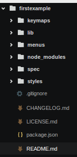

Este es la primera parte de una serie para dar a conocer lo básico referente a la creación de packages para el editor Atom
<!--more-->

* [1. Estructura de un package](192.168.1.4/Atom/1.CreateApackage)
* [2. Ejemplo simple en Coffeescript](192.168.1.4/Atom/2.FirstExampleCoffe)
* [3. Ejemplo simple en javascript](192.168.1.4/Atom/3.FirstExampleJavascript)

Los packages se pueden desarrollar tanto en Coffeescript como en javascript, aunque la mayoría de los
que se pueden encontrar por internet están escritos en Coffeescript.

Para generar una carpeta con la estructura que debe seguir un paquete, desde el propio Atom lanzamos
la paleta de comandos con `ctrl+alt+p` y escribimos **generate package**. nos preguntará la ruta donde
queremos generarlo y obtendremos una estructura como la siguiente:

Descripción de las carpetas:
*	keymaps = los keybinds de los comandos del package

*	lib = donde residen los modelos y conloadores que extienden el comportamiento de Atom

* 	menus = donde se definen los diferentes menus del package en formato JSON

* node_modules = donde se guardan librerias externas, es autogestionado por Atom al ejecutar el comando en la paleta **Update Package Dependencies:update**

* spec = test del codigo en lib, los archivos se llaman ejemplo-spec.coffe

* styles = carpeta para editar las vistas creadas usando LESS

* package.json = donde se definen:
	1. Entry point
	2. Dependencias
	3. Comandos creados por el package
